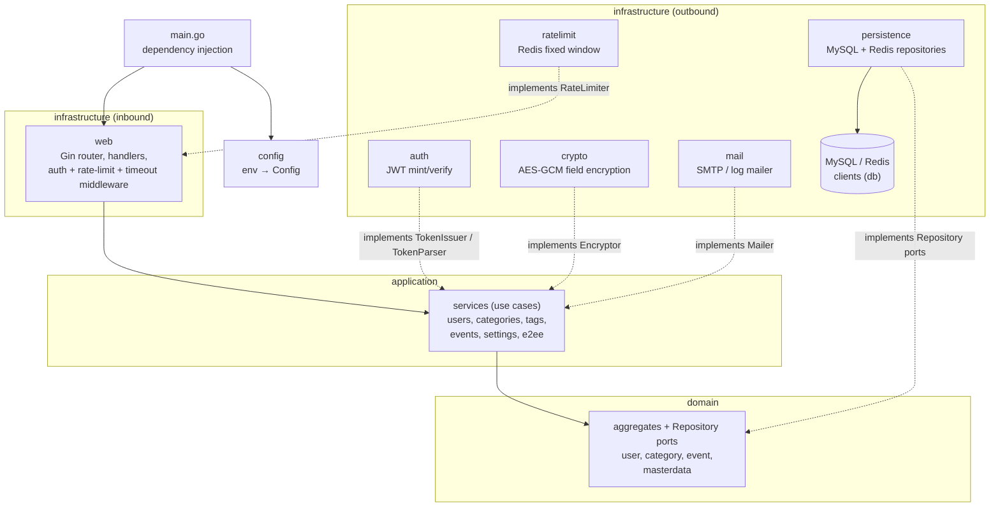

# Architecture

How the backend is layered and wired. Companion documents:
[domain-model.md](domain-model.md) (the *what*),
[auth-flows.md](auth-flows.md) and [api.md](api.md) (the HTTP surface).

## Layers

The backend follows a ports-and-adapters (hexagonal) layout under
`src/internal`: the domain defines the model and the persistence ports, the
application layer implements the use cases against those ports, and the
infrastructure provides every adapter — inbound (HTTP) and outbound
(MySQL/Redis, JWT, crypto, SMTP).



Dependency rule: arrows only point inward. `domain` imports nothing outside
itself; `application` imports only `domain` (plus stdlib); every
infrastructure package depends on the ports it implements, never the other
way around. `config` is read once in `main` — no other package calls
`os.Getenv`.

## Ports and adapters

| Port (interface) | Defined in | Adapter |
| --- | --- | --- |
| `user.Repository`, `category.Repository`, `event.Repository`, `e2ee.Repository` | `domain/*` | `infrastructure/persistence` (MySQL; the users repository also owns the Redis auth store) |
| `application.TokenIssuer` (mint/verify token pairs) | `application` | `infrastructure/auth.JWT` |
| `application.Encryptor` (at-rest field encryption) | `application` | `infrastructure/crypto.AES` |
| `application.Mailer` (transactional email) | `application` | `infrastructure/mail`: `LogMailer` when `SMTP_HOST` is empty, otherwise `SMTPMailer` wrapped in `AsyncMailer` |
| `application.*Service` (use-case ports) | `application` | consumed by `web` handlers |
| `web.TokenParser` (read tokens off requests) | `web` | `infrastructure/auth.JWT` |
| `web.SessionStore` (resolve session → user id) | `web` | users repository (Redis) |
| `web.Authenticator` | `web` | `web.TokenAuthenticator` (TokenParser + SessionStore) |
| `web.RateLimiter` | `web` | `infrastructure/ratelimit.RedisLimiter` |
| `web.E2EEFlagSource` (per-request E2EE mode) | `web` | `persistence.E2EERepository`, read once per request by `E2EEFlagMiddleware` |

All wiring happens in `main.go` (`inject`): adapters are built from the
config, repositories from the data sources, services from repositories, and
handlers from services — plain constructor injection, no framework.

## Request lifecycle

```
CORS middleware → security headers
  → body cap (1 MiB API-wide, 32 MiB on POST /e2ee/migrate)
    → handler timeout (HANDLER_TIMEOUT, 60 s on POST /e2ee/migrate; 503 on overrun)
      → per-route middleware: rate limit (public auth) or TokenAuthMiddleware (protected)
        → E2EEFlagMiddleware on the data routes: load the user's mode into the context
          → handler: bind + validate input, read user id from context
            → application service: use-case logic, encryption of sensitive fields
              → repository: SQL scoped by user id / Redis
```

`/healthz` sits outside the API group: unauthenticated, unthrottled, so
orchestrators can poll it. Besides the MySQL/Redis states it carries the
build `version` (`internal/version`, set through `-ldflags -X` from the
`VERSION` build argument; `dev` when unset). Gin is started with no trusted proxies, so
`ClientIP()` cannot be spoofed through `X-Forwarded-For` unless `TRUSTED_PROXIES`
says so — which must be set before deploying behind a reverse proxy, or the
per-IP rate limits all collapse onto the proxy's address
(see [deployment.md](deployment.md)).

Three cross-cutting rules the layers enforce:

- **Tenancy** — handlers never trust ids from the body; the authenticated
  user id comes from the middleware context and every repository query is
  scoped by it.
- **Encryption at rest** — category names, tag names and event
  descriptions are encrypted before they cross a persistence port
  (`enc*` parameters). The scheme is deterministic authenticated encryption
  (AES-GCM with an HMAC-derived synthetic nonce): deterministic so encrypted
  values can be looked up by equality, authenticated so tampering fails on
  decrypt.
- **E2EE mode** — for users who opted into end-to-end encryption, that
  at-rest layer is bypassed entirely: the services store and return the
  client's `e2ee:v1:` blobs verbatim, tag search moves to the client-supplied
  blind index, and the normalization, blacklist and date-tag rules the server
  can no longer apply are enforced by the client. The per-request flag comes
  from `E2EEFlagMiddleware`. See [e2ee.md](e2ee.md).

## Data stores

| Store | Holds |
| --- | --- |
| MySQL | `Users` (credentials, pin, pkey, challenge, settings columns, E2EE flag + key check), `Categories`, `Tags` (incl. the E2EE blind index), `Events`, `EventsTags` |
| Redis | Access/refresh sessions (`uuid → user_id`, TTL = token expiry), password-reset codes with their attempt counter and per-user cooldown (`pwdreset:*`, 15 min TTL), rate-limit counters (`rl:<endpoint>:<ip>`) |

Every table is owned by a user through a cascading foreign key, so deleting an
account (`DELETE /account`) needs no per-table sweep: the `Users` row carries
the whole dataset with it. Its Redis keys (`auth:*`, `pwdreset:*`) are deleted
explicitly, since Redis has no cascade — see
[auth-flows.md](auth-flows.md#account-deletion).

Schema migrations live in `db/migrations` (golang-migrate format).

## Configuration

Loaded from the environment (with `.env` fallback) by
`infrastructure/config`. Startup fails fast on unsafe values: missing,
placeholder or `< 32`-char secrets, and a wildcard/empty `CORS_ORIGIN`
outside DEV.

| Variable | Role |
| --- | --- |
| `ENVIRONMENT` | `DEV` / `PROD` — DEV extends access-token lifetime and keeps Gin in debug mode |
| `ACCESS_SECRET`, `REFRESH_SECRET` | JWT signing secrets |
| `ENCRYPT_SECRET` | Root secret for field encryption (enc + nonce keys derived via SHA-256) |
| `HOST` | Public base URL of the deployment (informational: the reset code is typed by the user, never linked) |
| `HOML_API_URL` | API route prefix |
| `CORS_ORIGIN` | Allowed CORS origin |
| `TRUSTED_PROXIES` | Proxies allowed to set `X-Forwarded-For` (comma-separated IPs/CIDRs); empty trusts none. Required behind a reverse proxy, see [deployment.md](deployment.md) |
| `HANDLER_TIMEOUT` | Per-request timeout (seconds) |
| `MYSQL_*`, `REDIS_*` | Data-source connections |
| `SMTP_*` | Password-reset email sending; an empty `SMTP_HOST` selects the log mailer (see [auth-flows.md](auth-flows.md)) |

## Runtime

Single binary listening on `:8080` (Gin). Shutdown is graceful: SIGINT/SIGTERM
closes the data sources, then gives in-flight requests 5 seconds to finish.
Connections are bounded by the server-wide `ReadTimeout`/`WriteTimeout` of
`main.go`; a route needing more (the E2EE migration) raises its own deadlines
through the `Deadlines` middleware, since those server timeouts are absolute
and a handler timeout cannot lift them.

Local orchestration (MySQL, Redis, API) is described in `docker-compose.yml`
and the `Makefile`; running it on a server is [deployment.md](deployment.md).

## Repository layout

```
homl-web/
├── db/migrations/           # golang-migrate SQL migrations
├── docs/                    # this documentation
└── src/
    ├── main.go              # config load, DI, HTTP server, graceful shutdown
    ├── cmd/seedgen/         # generates db/seeder.sql (demo data, encrypted)
    ├── test/                # mocks + build-tagged dbtest / e2e suites
    └── internal/
        ├── apperror/        # typed application errors → HTTP statuses
        ├── application/     # use-case services (one per aggregate)
        ├── domain/          # aggregates, value objects, Repository ports
        │   ├── category/  e2ee/  event/  masterdata/  user/
        └── infrastructure/
            ├── auth/        # JWT adapter (TokenIssuer, TokenParser)
            ├── config/      # env → Config, fail-fast validation
            ├── crypto/      # deterministic AES-GCM field encryption
            ├── db/          # MySQL + Redis clients
            ├── mail/        # SMTP / log / async mailers
            ├── persistence/ # repository implementations
            ├── ratelimit/   # Redis fixed-window limiter
            └── web/         # Gin router, handlers, middleware
```

Test layers and how to run them: [../TESTING.md](../TESTING.md).
