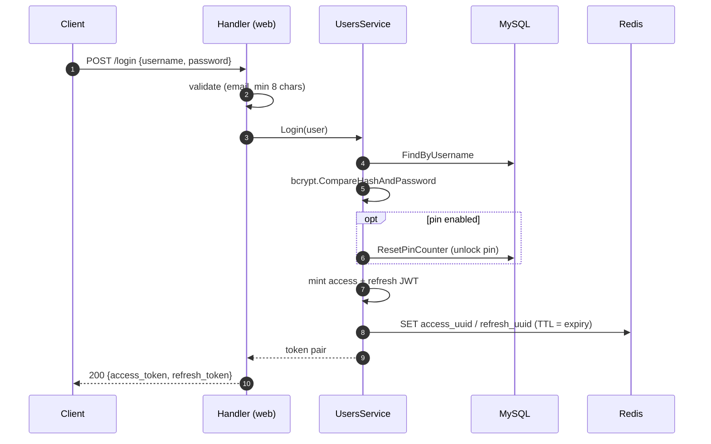
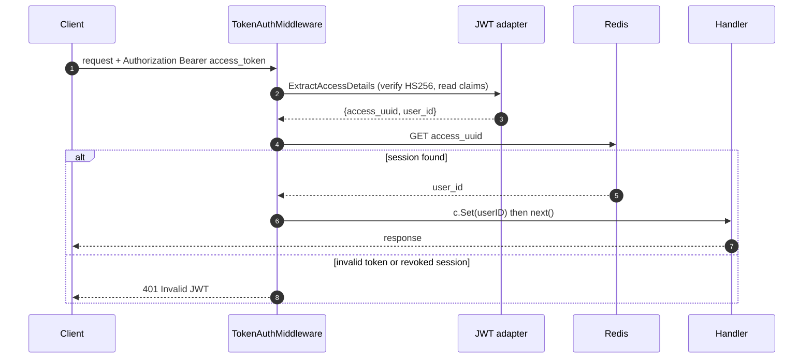
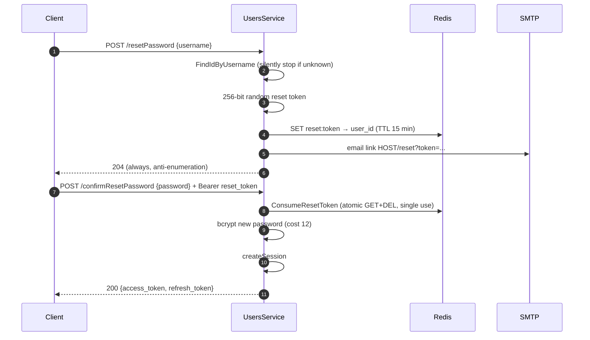

# Authentication flows

How authentication works end to end, across the client, the Gin handlers
(`infrastructure/web`), the users service (`application/user.go`), the JWT
adapter (`infrastructure/auth`), MySQL and Redis. Source of truth: the code —
regenerate this document when a flow changes.

## Token model

| Token | Format | Lifetime | Secret | Stored server-side |
| --- | --- | --- | --- | --- |
| Access token | JWT HS256 (`user_id`, `access_uuid`, `exp`) | 10 min (8 h in DEV) | `ACCESS_SECRET` | Redis: `access_uuid → user_id`, TTL = expiry |
| Refresh token | JWT HS256 (`user_id`, `refresh_uuid`, `exp`) | 6 months | `REFRESH_SECRET` | Redis: `refresh_uuid → user_id`, TTL = expiry |
| Reset token | Opaque, 256-bit URL-safe base64 | 15 min, single use | — (random) | Redis: `reset:<token> → user_id` |
| Challenge | 256-bit URL-safe base64 | Until consumed | — (random) | MySQL: `Users.challenge` |

Every session is materialized in Redis: a JWT that verifies cryptographically
but whose uuid is absent from Redis is rejected. This is what makes logout and
refresh rotation effective revocations.

Public auth endpoints are rate-limited per IP (fixed window in Redis):
login/registration 10/min, refresh 30/min, challenge 30/min, reset 5/hour.

## Login and registration

Registration creates the user and its default categories in one transaction,
then mints a session; login verifies the bcrypt hash (cost 12) and resets the
pin lockout counter. Both end in `createSession`: mint an access/refresh JWT
pair and store both uuids in Redis.

Any failure (unknown user, wrong password) returns the same
`401 Not authorized`, so the endpoint does not reveal which part failed.

## Authenticated request

`TokenAuthMiddleware` is the single authentication checkpoint for all
protected routes. It verifies the JWT signature **and** resolves the session
in Redis, so a revoked session (logout, rotation) is rejected before any
handler runs.

Handlers never trust ids from the body: they read the authenticated user id
from the context (`UserIDFromContext`) and every repository query is scoped by
it.

## Refresh with second factor (pin / fingerprint)

`POST /refresh` rotates the token pair. The second factor is enforced
**server-side**: once the account has pin or fingerprint enabled, a valid
refresh token alone is not enough.

The fingerprint factor is a challenge–response over ed25519: the client first
fetches a one-time challenge (`GET /challenge`), signs it with the private key
stored in the device's secure enclave, and sends the signature along with the
refresh. The server verifies against the public key (`pkey`) registered at
enrollment.

Details worth knowing:

- The challenge is consumed *before* signature verification, so a captured
  challenge/signature pair can never be replayed, even after a failed attempt.
- The pin lockout counter lives in MySQL (`pinTryCounter`); it is incremented
  on each wrong pin, refused outright at ≥ 3, and only reset by a successful
  pin check or a full password login.
- Refresh rotation deletes the old `refresh_uuid` first; if that uuid is
  already gone (token reuse), the refresh is rejected.

## Enabling pin / fingerprint (`PUT /secureAuth`)

Authenticated endpoint that switches the second factor. Invariants enforced by
the service:

- Pin and fingerprint are mutually exclusive.
- A pin comes with a `pkey`; a `pkey` is only accepted when a factor is
  enabled.
- Disabling the pin removes it; disabling both factors removes the `pkey`.
- The pin is bcrypt-hashed (cost 10) before it reaches the database — it is a
  low-entropy secret, protected primarily by the hard lockout.

Response echoes the resulting `{isFingerprintEnabled, isPinEnabled}`.

## Password reset

Anti-enumeration by design: `POST /resetPassword` always returns `204`,
whether or not the email exists, and email-sending failures are only logged.

The reset token is a dedicated opaque credential carried in the
`Authorization` header — never an access token — so it grants exactly one
operation: setting a new password for the user it is bound to.

`PUT /password` (authenticated) is the change-password variant: it verifies
the old password before hashing and storing the new one, and also returns a
fresh token pair.

## Logout

`POST /logout` clears the pending challenge and deletes the access session
from Redis (`DEL access_uuid`), which immediately invalidates the access
token at the middleware. Returns `204`.
