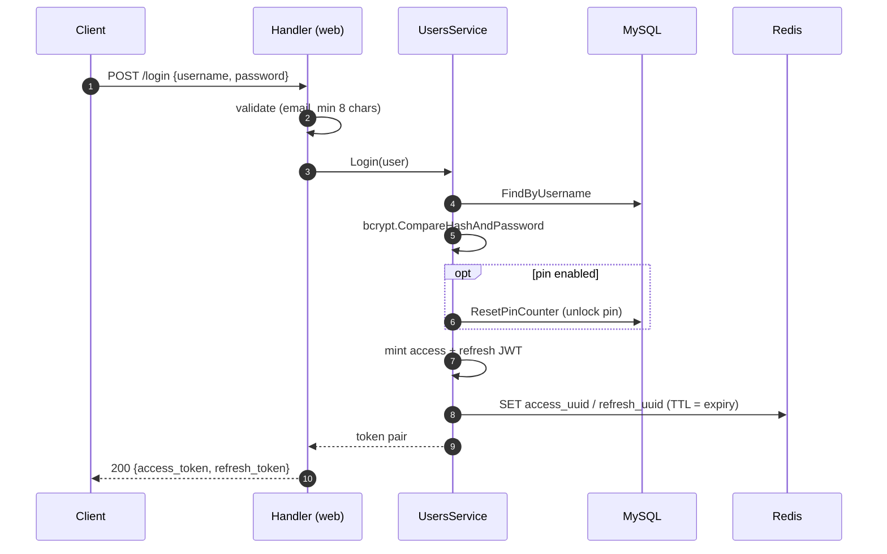
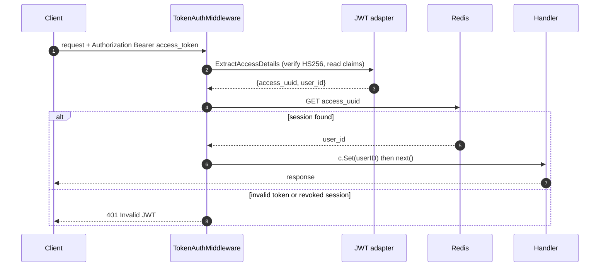
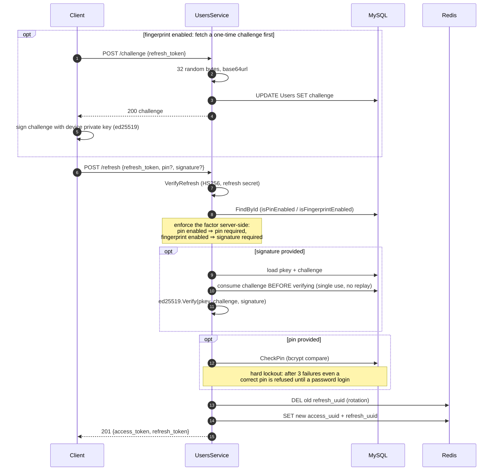
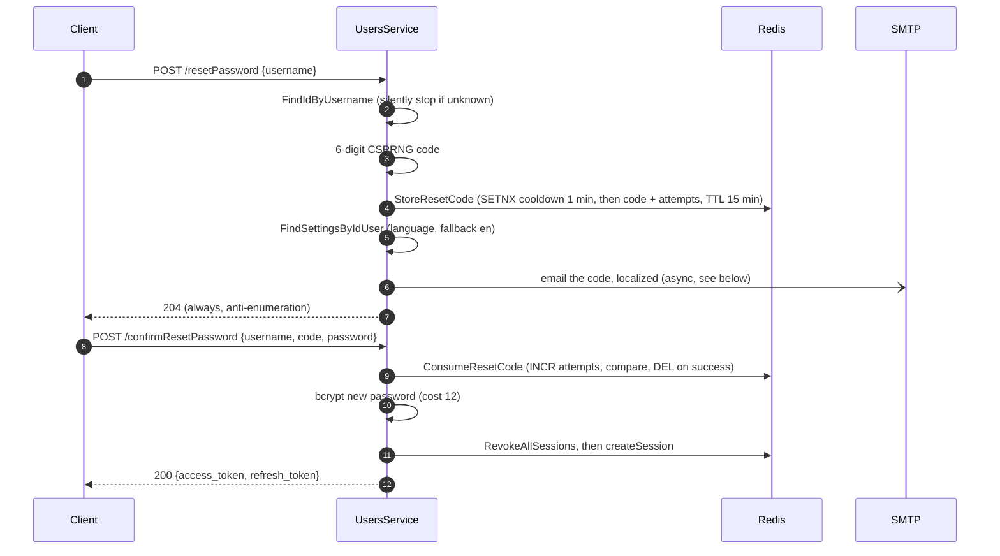

# Authentication flows

How authentication works end to end, across the client, the Gin handlers
(`infrastructure/web`), the users service (`application/user.go`), the JWT
adapter (`infrastructure/auth`), MySQL and Redis. Source of truth: the code —
regenerate this document when a flow changes.

## Token model

| Token | Format | Lifetime | Secret | Stored server-side |
| --- | --- | --- | --- | --- |
| Access token | JWT HS256 (`user_id`, `access_uuid`, `exp`) | 10 min (8 h in DEV) | `ACCESS_SECRET` | Redis: `access_uuid → user_id`, TTL = expiry |
| Refresh token | JWT HS256 (`user_id`, `refresh_uuid`, `exp`) | 6 months | `REFRESH_SECRET` | Redis: `refresh_uuid → user_id`, TTL = expiry |
| Reset code | 6 decimal digits (CSPRNG) | 15 min, single use, 5 guesses | — (random) | Redis: `pwdreset:code:<user_id>`, plus `pwdreset:attempts:<user_id>` and `pwdreset:cooldown:<user_id>` |
| Challenge | 256-bit URL-safe base64 | Until consumed | — (random) | MySQL: `Users.challenge` |

Every session is materialized in Redis: a JWT that verifies cryptographically
but whose uuid is absent from Redis is rejected. This is what makes logout and
refresh rotation effective revocations.

Public auth endpoints are rate-limited per IP (fixed window in Redis):
login/registration 10/min, refresh 30/min, challenge 30/min, reset 5/hour. The
limiter namespaces its counter per endpoint name, so both reset endpoints share
one `rl:reset:<ip>` budget. It fails open if Redis errors, to avoid locking
users out on a blip.

## Login and registration

Registration creates the user and its default categories in one transaction,
then mints a session; login verifies the bcrypt hash (cost 12) and resets the
pin lockout counter. Both end in `createSession`: mint an access/refresh JWT
pair and store both uuids in Redis.



Any failure (unknown user, wrong password) returns the same
`401 Not authorized`, so the endpoint does not reveal which part failed.

## Authenticated request

`TokenAuthMiddleware` is the single authentication checkpoint for all
protected routes. It verifies the JWT signature **and** resolves the session
in Redis, so a revoked session (logout, rotation) is rejected before any
handler runs.



Handlers never trust ids from the body: they read the authenticated user id
from the context (`UserIDFromContext`) and every repository query is scoped by
it.

## Refresh with second factor (pin / fingerprint)

`POST /refresh` rotates the token pair. The second factor is enforced
**server-side**: once the account has pin or fingerprint enabled, a valid
refresh token alone is not enough.

The fingerprint factor is a challenge–response over ed25519: the client first
fetches a one-time challenge (`POST /challenge`), signs it with the private key
stored in the device's secure enclave, and sends the signature along with the
refresh. The server verifies against the public key (`pkey`) registered at
enrollment.



Details worth knowing:

- The challenge is consumed *before* signature verification, so a captured
  challenge/signature pair can never be replayed, even after a failed attempt.
- The pin lockout counter lives in MySQL (`pinTryCounter`); it is incremented
  on each wrong pin, refused outright at ≥ 3, and only reset by a successful
  pin check or a full password login.
- Refresh rotation deletes the old `refresh_uuid` first; if that uuid is
  already gone (token reuse), the refresh is rejected.

## Client session: the second factor, and a server out of reach

How the Flutter client (`homl-ui/lib/data/repositories/api.dart`) drives the
flows above. The server is often out of reach — a phone away from the home
network cannot see a NAS on the LAN — and losing the connection must not cost
the session, nor the data saved on the device.

### What ends a session, and what does not

Only a `401` on `/refresh` or `/challenge` is a verdict on the session:

| Answer | Client |
| --- | --- |
| `401 Not authorized` (revoked, expired or reused refresh token) | ends the session: refresh token, cached data (events, categories, settings) and the offline PIN are removed; the PIN keypair and the E2EE seed stay, as on logout |
| `401 PIN_LOCKED` | same, with the pin lockout message |
| `401 PIN_INCORRECT` | stays on the pin dialog, `attemptsRemaining` shown |
| `401 SECOND_FACTOR_REQUIRED` | answered with the session's factor (below); a factor this device cannot produce (enabled from another device) ends the session |
| anything else: no network, a timeout, `502`/`503`/`504`, another `5xx`, `429`, a page that is not ours (captive portal) | keeps everything and goes **offline** |

### The session's second factor

The pin, or the fingerprint keypair released by the OS prompt, is asked once
when the app opens and then **held in memory** for the life of the session
(never persisted). Every later refresh sends it: each time the access token
expires (10 minutes in PROD), and when the server comes back after an offline
start. Without it, a pin or fingerprint account used to be refused with
`Pin must be provided` on its first silent refresh, which the client took for
a dead session: logged out, cached data wiped, ten minutes after unlocking.

When the session does not hold the factor (enabled from the Security page in
the meantime, or after a password login), a refresh the user is waiting on
asks for it: the fingerprint prompt, or the pin dialog. A held pin the server
refuses is dropped and asked again rather than spent on the lockout.

### Offline unlock

At app start the refresh token is still sent first; when the server cannot be
reached, the session opens on the data saved on the device once the account's
own factor has passed a local check:

| Account | Server reachable | Server unreachable |
| --- | --- | --- |
| No second factor | `POST /refresh` | opens directly |
| Fingerprint | the OS prompt releases the keypair, which signs a fresh challenge | the same prompt: releasing the keypair is the proof of presence |
| Pin | pin + signature of a fresh challenge; the server checks the pin, 3-strike lockout | the pin is checked against a hash kept on the device, with its own 3-strike lockout |

The offline pin check uses a PBKDF2-HMAC-SHA256 hash (600 000 iterations,
random 16-byte salt) of the last pin the server accepted **on this device**,
stored in the secure storage (`pinVerifier`) with a count of wrong offline
tries (`pinOfflineFailures`). The third wrong pin ends the session exactly like
`PIN_LOCKED`. The hash is written when the server accepts the pin (unlock or
setup) and removed whenever the session ends, so a pin account that has not
entered its pin online since its last login cannot unlock offline yet — the
dialog says so.

The trade-off, accepted on purpose so the pin setting keeps working offline:
the server's lockout protects a 4-digit pin because every guess goes through
it. Whoever can read the secure storage of the phone (not just hold the phone:
break into it) can try the 10 000 pins against the stored hash on another
machine, in minutes. They could read the cached data anyway; what they gain is
the pin itself, which then passes the server's second factor with the stolen
refresh token until the password is changed (which revokes every session).
Password managers make the same trade-off for their "unlock with PIN". Someone
merely holding the phone gets 3 tries, as online.

There is no time limit on an offline session: the server decides at the next
contact (a refresh token past its six months, or revoked by a password change
elsewhere, ends the session then).

### Reconnection

- Connect timeout 5 s (the unreachable LAN address usually drops the packets
  silently), receive timeout 30 s (2 minutes for the E2EE migration and purge).
- For 10 s after a network failure, requests fail at once instead of each
  waiting for its own timeout.
- While offline and in the foreground, the client probes `GET /healthz`
  (3 s timeout) with a 5 s → 2 min backoff, and at once when the app returns
  to the foreground. Only a `200` with a JSON body counts.
- When the server answers, the session reopens with a refresh carrying the
  held factor; the screens then reload and the E2EE gate runs again on fresh
  settings. A regular request answered in JSON (or `204`) also ends the
  offline state.
- Offline, the app is read-only: browsing and searching work on the cached
  data, a write fails with "server unreachable" and keeps what was typed.

## Enabling pin / fingerprint (`PUT /secureAuth`)

Authenticated endpoint that switches the second factor. Invariants enforced by
the service:

- Pin and fingerprint are mutually exclusive.
- A pin comes with a `pkey`; a `pkey` is only accepted when a factor is
  enabled.
- Disabling the pin removes it; disabling both factors removes the `pkey`.
- The pin is bcrypt-hashed (cost 10) before it reaches the database — it is a
  low-entropy secret, protected primarily by the hard lockout.

Response echoes the resulting `{isFingerprintEnabled, isPinEnabled}`.

The client writes its own flags (the PIN keypair, the fingerprint flag) only
once this call succeeded: they pick the factor the next app start sends, and a
toggle that failed offline would otherwise get that refresh refused — and the
session ended.

## Password reset

Anti-enumeration by design: `POST /resetPassword` always returns `204`,
whether or not the email exists, and email-sending failures are only logged.



The code is a short-lived credential the user retypes, so it never travels in a
URL and never becomes a token: `confirmResetPassword` is unauthenticated and
binds the code to the `username` in the body. What keeps a 6-digit secret safe
is the layering, all enforced server-side in Redis:

- **Cooldown** — `SETNX pwdreset:cooldown:<id>` (1 min) gates issuance, so the
  endpoint cannot be used to email-bomb an address.
- **Guess budget** — `INCR pwdreset:attempts:<id>` runs *before* the
  comparison, so concurrent wrong guesses still burn the budget; past 5 the
  code and counter are deleted outright.
- **Constant-time compare** and a single shared error (`401
  RESET_CODE_INVALID`) for unknown user, wrong code, expired code and exhausted
  budget alike.
- **Single use** — the correct code is deleted before the password is written.

`PUT /password` (authenticated) is the change-password variant: it verifies
the old password before hashing and storing the new one, and also returns a
fresh token pair.

### Sending the email

`main.go` picks the `Mailer` at startup on one criterion: `SMTP_HOST` empty
selects `LogMailer`, which writes the code to the application log and sends
nothing. Anything else selects `SMTPMailer`, wrapped in `AsyncMailer` — the
environment plays no part, so the real SMTP path can be exercised locally.

The send is **detached from the request**. It used to run inline, which made the
unconditional `204` a lie in two ways: a submission server slower than
`HANDLER_TIMEOUT` turned it into a `503`, and response time depended on whether
the address was found — the enumeration signal the whole flow withholds
elsewhere. `AsyncMailer` returns immediately, logs delivery errors (never the
recipient), and caps concurrent sends; a send in flight is lost if the process
stops. `SMTPMailer` puts a single 10 s deadline over the entire exchange, since
`net/smtp` has no timeout of its own.

What the message itself needs to be accepted, all covered by
`mail/smtp_test.go`:

- **`Date` and `Message-ID`** — absent, they are a standard spam signal
  (SpamAssassin `MISSING_DATE` / `MISSING_MID`).
- **MIME encoded-word subject** and a **quoted-printable body**, so the accented
  French and German templates survive servers that do not announce 8BITMIME.
  Raw UTF-8 in a header is non-conformant and gets mangled or scored.
- **`SMTP_USER`** distinct from `SMTP_FROM` (it defaults to it). Only mailbox
  providers accept the sender address as the auth identity; API relays want
  their own username (SendGrid `apikey`, SES IAM credentials, Mailgun
  `postmaster@domain`).
- **Port 465** dials implicit TLS, 587/25 upgrade through STARTTLS. With a
  password set and no STARTTLS offered, `PlainAuth` fails closed rather than
  sending credentials in the clear. An empty password skips authentication
  entirely, which is what local catchers expect.

Deliverability still depends on SPF/DKIM/DMARC on the `SMTP_FROM` domain, which
is deployment configuration, not code.

### Testing the flow locally

Without SMTP, `LogMailer` makes the flow testable with no mail server at all:

```bash
make dev
docker compose logs -f homlback   # "DEV mailer: password reset code for … : 123456"
```

To exercise `SMTPMailer` and the localized templates instead, copy
`docker-compose.local.example.yml` to `docker-compose.local.yml` (the Makefile
picks it up automatically): it adds a Mailpit catcher and points `SMTP_HOST` at
it. Emails then land on <http://localhost:8025>.

Two throttles will interrupt a test loop — the 5/hour per-IP budget shared by
both endpoints, and the 1-minute per-user cooldown. Clear them between runs:

```bash
for p in 'rl:reset:*' 'pwdreset:*'; do
  docker exec redis_container sh -c "redis-cli --no-auth-warning -a \"\$REDIS_PASSWORD\" \
    --scan --pattern '$p' | xargs -r redis-cli --no-auth-warning -a \"\$REDIS_PASSWORD\" del"
done
```

## Logout

`POST /logout` clears the pending challenge and deletes the access session
from Redis (`DEL access_uuid`), which immediately invalidates the access
token at the middleware. Returns `204`.

## Account deletion

`DELETE /account` takes the password again (`{ "password": "..." }`) and
compares it with bcrypt, exactly like `PUT /password`: an access token alone —
stolen, or found on an unlocked phone — must not be able to destroy the data.
A wrong password answers `401` and changes nothing.

The order of the three steps matters:

1. `RevokeAllSessions` — every live access/refresh pair of the user.
2. `DeleteResetCodes` — `pwdreset:code|attempts|cooldown:<id>`, so a code
   issued moments earlier cannot outlive the account on its remaining TTL.
3. `DELETE FROM Users WHERE id = ?` — the irreversible step, hence last. The
   schema does the rest: `Categories`, `Events` and `EventsTags` cascade from
   the user row, `Tags` (and their synonyms) from the categories.

Redis is purged *before* the row because a failure at any point then leaves a
consistent, recoverable account — at worst logged out everywhere, which the
user fixes by logging in again. The reverse order would leave live sessions
resolving a user id that no longer exists until their TTL expired.

Returns `204`. The client then wipes its local state, E2EE seed included, and
lands on the login screen with a confirmation toast.
