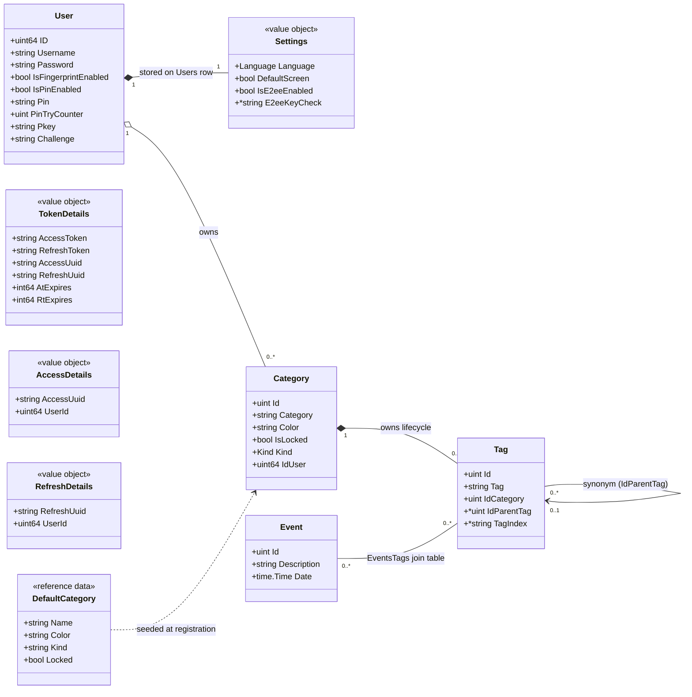

# Domain model

Curated view of the backend domain layer (`src/internal/domain`). The code is
the source of truth — regenerate this document whenever an aggregate changes.

The domain is split into three aggregates (`user`, `category`, `event`), a
static reference-data package (`masterdata`) and a cross-cutting feature
package (`e2ee`). Each aggregate package holds its entities, value objects,
DTOs and a `Repository` interface that acts as its persistence port
(implemented in `src/internal/infrastructure/persistence`).

## Aggregates and relations

## Aggregate notes

### User (`domain/user`)

- Root of authentication and per-user configuration. Passwords are bcrypt
  hashed (`PasswordBcryptCost = 12`); the pin uses a lower cost and is
  protected by a hard lockout (`PinTryCounter`).
- `Settings` is a value object with no identity of its own — one row per
  user, persisted as columns of the `Users` table (`language`,
  `defaultScreen`, plus the read-only `isE2eeEnabled` flag flipped by the
  E2EE migration; `e2eeKeyCheck` verifies a recovery phrase — see
  [e2ee.md](e2ee.md)).
- `TokenDetails`, `AccessDetails` and `RefreshDetails` are auth value objects;
  token state lives in Redis, the rest of the aggregate in MySQL.
- Registration creates the user **and** its default categories in one
  transaction (see [Masterdata](#masterdata-domainmasterdata)).
- Deletion is a hard delete of the aggregate root: one `DELETE` on the `Users`
  row, and the schema cascades to every owned aggregate (categories → tags →
  synonyms, events, event-tag links). The Redis half of the aggregate
  (sessions, reset codes) is purged first — see
  [auth-flows.md](auth-flows.md#account-deletion).

### Category (`domain/category`)

- Root of the tagging system. A `Tag` never exists without its owning
  category: its lifecycle (move on category delete, blacklist rules) is
  enforced through the category root, and tag persistence operations live on
  the category `Repository`.
- `Kind` identifies the role of a category (`date`, `person`, `other`,
  `custom`); `IsLocked` marks the ones that are fully read-only for the user
  (the seeded date and other categories — the seeded person category is a
  plain unlocked suggestion). See
  [default-categories.md](default-categories.md) for the full rules.
- A tag may reference another tag of the same category as its parent
  (`IdParentTag`): synonyms, one level deep, available in every category
  except the date one (see [tag-synonyms.md](tag-synonyms.md)). A "person"
  is not a dedicated aggregate: it is an ordinary tag (plus synonyms for its
  alternative names) in whatever category the user likes.
- `TagIndex` is the client-side blind index of E2EE users (NULL otherwise):
  uniqueness and tag search use it when the `tag` column holds opaque client
  blobs. See [e2ee.md](e2ee.md).

### E2EE (`domain/e2ee`)

- Cross-cutting feature package, not an aggregate: the `e2ee:v1:` payload
  format and its shape validators, the per-request mode flag carried in the
  context (set once per request by the web middleware, branched on by the
  application and persistence layers), the migration DTOs and the migration
  persistence port. See [e2ee.md](e2ee.md).

### Event (`domain/event`)

- An event is a dated description linked to any number of tags through the
  `EventsTags` join table (scoped by user).

### Masterdata (`domain/masterdata`)

- Static reference data embedded in the binary at build time
  (`constants.json`): the default categories seeded for every new user (the
  first one is the "Dates" category) and the blacklisted tag names users are
  not allowed to create.

## Persistence ports

Each aggregate exposes one `Repository` interface, implemented against MySQL
(and Redis for auth) in `infrastructure/persistence`. Fields prefixed `enc` in
port signatures are encrypted at rest by the application layer before
crossing the port.

| Port | Responsibilities |
| --- | --- |
| `user.Repository` | Registration (user + default categories, transactional), lookup, password/pin/fingerprint updates, Redis auth sessions, single-use password-reset codes (attempt counter + cooldown), settings read/write, hard delete of the account (cascades) + reset-code cleanup |
| `category.Repository` | Category CRUD (delete moves the tags to Others or removes them, optionally with every event they tag), tag CRUD (synonyms included, moving a main tag takes its synonyms along), tag lookup by name, usage counts (`TagUsage`, `CategoryUsage`) |
| `event.Repository` | Event CRUD with tags, per-user listing |
| `e2ee.Repository` | E2EE flag lookup, atomic whole-dataset enable/disable migration, lost-key purge (reseeds the default categories) |

## DTOs

Response/input shapes colocated with their aggregate, used by the application
and web layers: `user.UserResponse`, `user.UserPassword`, `user.RefreshInput`,
`user.SettingsResponse`, `category.GetCategoryResponse`, `category.TagDTO`,
`event.GetEventsResponse`.
